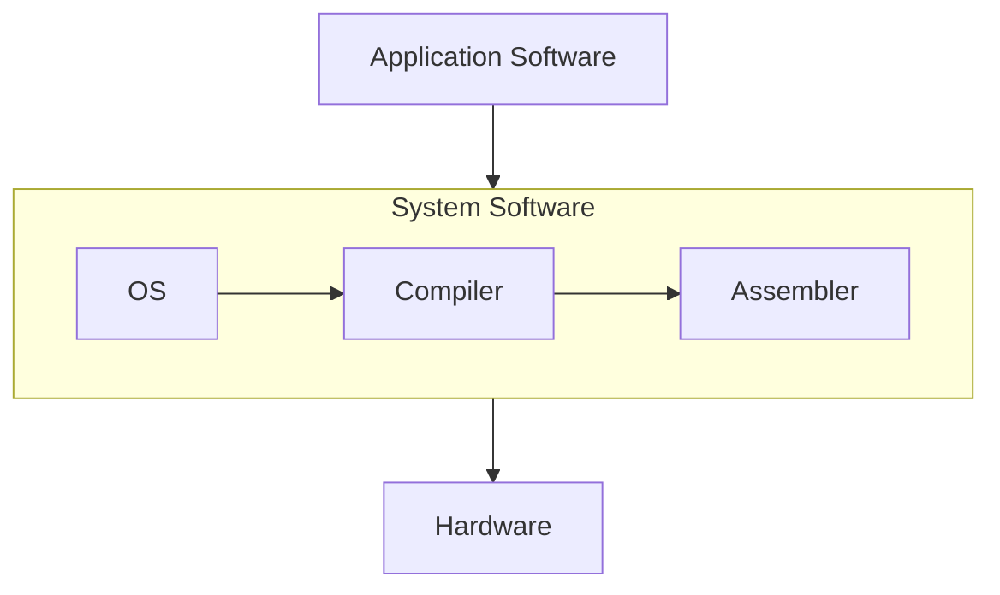

# Digital VLSI SoC Design & Planning
VLSI (Very Large Scale Integration) is the process of designing and manufacturing Integrated Circuits (ICs) that integrate thousands to billions of transistors onto a single silicon wafer. These transistors are interconnected to form highly complex circuits that perform specific functions, ranging from simple arithmetic operations to advanced data processing.
### VLSI design flow
 The VLSI design flow is a structured methodology for developing integrated circuits efficiently and effectively. It guides designers through key stages, including specification, design entry, synthesis, verification, layout, and fabrication. The flow aims to minimize design time while ensuring high-quality and reliable products. By breaking the process into manageable tasks, it helps focus on specific design aspects at each stage. This approach streamlines the workflow, reduces errors, and boosts team productivity.
<details>
  <summary><b>Typical design flow</b></summary>

  <p align="center">
    
  </p>

  1. **Design Specification**: Defines the functional and performance requirements of the design, including target performance and design constraints.
  2. **Behavioral Description**: Describes the system's functionality at a high level, focusing on what the system should do without detailing its hardware implementation.
  3. **RTL Description (HDL)**: Specifies the design using Hardware Description Language (HDL), detailing the logic and structure in a synthesizable form.
  4. **Functional Verification and Testing**: Ensures the design behaves as expected by simulating the RTL code and checking for correctness.
  5. **Logic Synthesis**: Transforms the RTL code into a gate-level representation, optimizing the design for area, power, and speed.
  6. **Gate-Level Netlist**: Produces a collection of logic gates and their interconnections, representing the synthesized design.
  7. **Logical Verification and Testing**: Verifies the gate-level design by running functional tests to check its correctness against the original specification.
  8. **Floor Planning, Automatic Place & Route**: Determines the physical placement of components on the chip and routes the interconnections to meet timing and area constraints.
  9. **Physical Layout**: Generates the final layout design, specifying the exact physical locations and connections for all components.
  10. **Layout Verification**: Ensures that the physical layout adheres to design rules and checks for issues such as signal integrity and manufacturability.
  11. **Implementation**: Finalizes the design for manufacturing by preparing the GDSII file, which is used in the fabrication process.

</details>

## Content
- [Day 1 - Inception of open-source EDA, OpenLANE and Sky130 PDK](#day-1---inception-of-open-source-eda-openlane-and-sky130-pdk)
- [Day 2 - Good floorplan vs bad floorplan and introduction to library cells](#day-2---good-floorplan-vs-bad-floorplan-and-introduction-to-library-cells)
- [Day 3 - Design library cell using Magic Layout and ngspice characterization](#day-3---design-library-cell-using-magic-layout-and-ngspice-characterization)
- [Day 4 - Pre-Layout timing analysis and importance and good clock tree](#day-4---pre-layout-timing-analysis-and-importance-and-good-clock-tree)
- [Day 5 - Final steps for RTL2GDS using tritonRoute and openSTA](#day-5---final-steps-for-rtl2gds-using-tritonroute-and-opensta)
## Day 1 - Inception of open-source EDA, OpenLANE and Sky130 PDK
<details>
### How to talk to computers
Arduino is a popular example of an embedded development board which has ATMEGA328 microcontroller. Suppose we want to create an IC similar to this using the above flow. The GDSII obtained is sent to the foundry where the photomasks created for photolithography, a process used to etch the circuit patterns onto the silicon wafer. Multiple copies of the same circuit are etched onto the wafer, organized in a grid-like pattern. Once the circuits are fabricated onto the wafer, the wafer is cut into individual units. Each of these units is called a die. The die represents a complete integrated circuit (IC), and each **die** is a single functional unit of the circuit.
<p align="center">
  
  
</p>

The **die** is divided into two main sections: **pads** and the **core**.
-	**Pads**: These form the interface between the circuit and the external world. They enable electrical connections for power, ground, and input/output (I/O) signals.
-	**Core**: This houses the functional logic of the circuit. It comprises:
    -	**IPs** **(Intellectual Properties)**: Pre-designed and verified complex blocks (e.g., processors, memory, or communication interfaces) provided by vendors (foundries or EDA tool providers) or developed in-house. These require advanced techniques to integrate and function properly.
    -	**Macros**: Simpler blocks compared to IPs. These can be designed more easily and are often customized for specific functionalities.

**Foundry**: A **foundry** is a specialized manufacturing facility that produces semiconductor wafers and integrated circuits (ICs) designed by other companies.
After cutting, the individual dies are then encapsulated in a protective **package**. This is necessary for handling and connecting the die to the external world (such as through electrical pins or pads). The packages can be of different types. The most common IC package types are 
1.	Dual In-Line Package (DIP)
2.	Small Outline Package (SOP)
3.	Quad Flat Package (QFP)
4.	Quad Flat No-leads (QFN)
5.	Ball Grid Array (BGA)
6.	Chip Scale Package (CSP)
7.	Dual Flat No-leads (DFN)
8.	Quad Flat Package No-lead (QFN-ML)

**Instruction Set Architecture(ISA):**\
An Instruction Set Architecture (ISA) is the interface between a computer's hardware and software. It defines the set of instructions a processor can execute, including operations like arithmetic, data movement, and control flow. Example : x86, ARM , RISC-V

**The Bigger Picture:**

An application software that we use on PCs or mobiles are converted into binary language(machine code) by the system software which is then executed by the hardware.
System Software
-	**Operating System(OS)**
    -  Handle I/O operations, allocate memory, low level system functions
-	**Compiler**
    - Converts the application written in high level language(C, C++, Java) into assembly language of the respective ISA.
-	**Assembler**
    - The Assembly code from previous step is converted to binary language by the Assembler.

### SoC Design and OpenLANE
**Digital ASIC Design**
Requires several elements 
-	RTL IP’s
-	EDA Tools
-	PDK Data
  <p align="center">
    
  </p>
  
***Opensource RTL*** – Many opensource IP’s are available online. Some of the websites where they can be found are 
Librecores.org,
Opencores.org,
Github.com (github alone has 7000 repo).

***Opensource EDA Tools*** - Early EDA tools were result of academic requirements. Examples are Magic, Spice Simulator, qflow, OpenRoad, OpenLane.

***Open PDKs*** - In early days, the design of an IC was tightly integrated with the manufacturing processes available within each company. Those who controlled the physics controlled the creative agenda. Lynn Conway and Carver Mead envisioned the need for separating the design from technology;
Pioneered the "structured" design methodology based on the λ-based rules
Since then, we started to see Pure Play Fabs and Fabless design companies.  
What is PDK?  
PDK(Process Design Kit), is the interface b/w the FAB and the designers. Collection of files used to model a fabrication process for the EDA tools used to design an IC.
- Process Design Rules : DRC, LVS, PEX
- Device Models
- Digital Standard Cell Libraries
- I/O Libraries  
They are distributed under NDA, made difficult for mass production. Google partnered with skywater and release open source PDK skywater130. This is 130nm process, it may seem old/irrelevant but most applications don't need the advanced nodes due to high cost of production. The market share is as shown below.
  <p align="center">
    
  </p>
The 6%, which amounts to 4.7B annual revenue. In terms of performance, the following examples will convince you!!
  <p align="center">
    
  </p>
  
**Simplified ASIC design flow**
  <p align="center">
    
  </p>
  
***Synthesis :*** Design RTL is converted to circuit made out elements from standard cell library. The resultant circuit is described in HDL and usually referred to as the gate level netlist. A gate level netlist Is functionally equivalent to the RTL.  
The library building blocks for the cells have regular layouts typically the cell layout of fixed heights rectangle with is variable but discrete integer multiple of a fixed value called site width. Each cell comes with different view/models.  
-	Electrical (liberty format; delay, power models), HDL (behavioral), SPICE(cdl),
-	Layout (Abstract(lef) and detailed(gdsii))
  <p align="center">
    
  </p>
  
***Floor and Power planning :*** Depends on whether a macro or entire chip. The objective is to plan Silicon area and create robust power distribution network to power the circuit.  
Chip floor planning: Partition the chip die into different system building blocks and place the I/O pads.  
  <p align="center">
    
  </p>
Macro Floor planning: Dimensions, pin locations, row definitions  
  <p align="center">
    
  </p>
  
***Power planning***
  <p align="center">
    
  </p>
Uses upper metal layers as they are thicker than lower metal layers hence have lower resistance.  

***Placement :*** Place the cells on the floorplan rows aligned with the sites. In 2 types; global and detailed. Finds optimal position for the cells May not be legal. The positions are legalized by making minor adjustments  to the position of the cells.
  <p align="center">
    
  </p>
  <p align="center">
    
  </p>
  
***lock Tree synthesis :***
Create a clock distribution network
-	To deliver the clock to all sequential elements (e.g., FF).
-	With minimum skew (zero is hard to achieve).
-	And in good shape
-	Usually a Tree (H, X, …).
  <p align="center">
    
  </p>

***Routing :***
Implement the interconnect using the available metal layers, the PDK defines the thickness pitch, tracks and the minimum width.
  <p align="center">
    
  </p>
  
Skywater130 :
This PDK defines 6 routing layers, lowest called local interconnect layer (TitaniumNitride layer), the following layers are all Aluminum.  
Metal tracks form a routing grid  
Routing grid is huge  
Divide and Conquer
-	Global Routing: Generates the routing guides
-	Detailed Routing: Uses the routing guides to implement the actual wiring

***Signoff :***
Once done with routing we can construct the final layout, which undergoes verification that includes,  
- Physical Verification
  - Design rule checking(DRC)
  - Layout v/s Schematic(LVS)
- Timing Verification
  - Static Timing Analysis(STA)

**OpenLANE :** Can I build a chip using this flow?  
This flow can be used with commercial EDA Tools. The problem is tougher when using opensource EDA
- Tools qualification
- Tools calibration
- Missing tools
Open lane is a reference ASIC flow by efabless public repo on github. Started as an open-source flow for a true open source tape-out experiment.
striVe si a family of open everything SoCs
-	Open PDK, Open EDA, Open RTL
  <p align="center">
    
  </p>
  
**Main goal of OpenLane:**
- Produce a clean GDSII with no human intervention (no-human-in-the-loop). Clean means:
  -	No LVS violations
  -	No DRC violations
  -	Timing violations? WIP!
- Tuned for SkyWater 130nm Open PDK  
  -	Also supports XFAB180 and GF130G
- Containerized  
  -	Functional out of the box
  -	Instructions to build and run natively will follow
- Can be used to harden macros and chips  
- Two modes of operation:
  -	Autonomous or Interactive
- Design Space Exploration  
  - Find the best set of flow configurations.  
- Large number of design examples  
  -	43 designs with their best configurations
  -	More will be added soon

**Open lane ASIC design flow:**
  <p align="center">
    
  </p>
  
The flow starts with the design RTL and ends with the final layout in the GDSII format. To function it  needs the PDK. Open lane is based on several open source projects such as openRoad Yosys, ABC, QFlow, Fault, etc.  

***RTL synthesis:*** the RTL is fed to yosys along with design constraints. Yosys translates the RTL into a logic circuit using generic components. This circuit can be optimized and mapped into cells from SCL using ABC. ABC has to be guided during the optimization and this guidance comes in the form of ABC script. Openlane comes with several ABC scripts. With different synthesis strategies. We have strategies that targets area, timing, etc. Different strategies can be used to obtain the required objectives. Synthesis exploration utilities that can be used to generate a report that shows how the design delay and area is affected by the synthesis strategy, based on this we can pick the best synthesis strategy to continue with.  

Also openlane has design exploration utilities which can be used to sweep the design configurations and generates a report, which shows design metrics 
  <p align="center">
    
  </p>

The design exploration utility is also used for regression testing(CI)
We run openlane on ~70 designs and compare the results to the best known ones  
  <p align="center">
    
  </p> 
  
**Design for Testing :** After synthesis comes the testing structure insertion, if we want our design to be ready for  testing after fabrication  we can enable this step which is optional. This step uses opensource project fault to perform 
-	Scan insertion
-	Automatic Test Pattern Generation (ATPG)
-	Test Patterns Compaction
-	Fault Coverage
-	Fault Simulation
  <p align="center">
    
  </p> 
  
Adds extra logic, scan chain and data controller- access to scan chain  

**Physical Implementation :** Also called automated PnR (Place and Route). We use openRoad app.    
-	Floor/Power Planning
-	End Decoupling Capacitors and Tap cells insertion
-	Placement: Global and Detailed 
-	Post placement optimization
-	Vlock Tree Synthesis(CTS)
-	Routing : Global and Detailed.

**Logic equivalence checking(LEC)** using yosys: since the netlist generated from synthesis modigied by the optimizations, Logic equivalence check must be performed to ensure the functional equivalence
Everytime the netlist is modified, verification must be performed
-	CTS modifies the netlist
-	Post Placement optimizations modifies the netlist
LEC is used to formally confirm that the function did not change after modifying the netlist.

**Antenna Rules Violation**  
When a metal wire segment is fabricated, it can act as an antenna
-	Reactive ion etching causes charge to accumulate on the wire
-	Transistor gates can be damaged during the fabrication process.
  <p align="center">
    
  </p> 

Two solutions:
-	Bridging attaches a higher layer intermediary
  -	Requires router awareness(not there yet)
-	Add antenna diode cell to leak away charges 
  - Antenna diodes are provided by the SCL.
  <p align="center">
    
  </p> 
  <p align="center">
    
  </p> 

We took a preventive approach
-	Add a Fake antenna diode next to every cell input after placement
-	Run the Antenna checker (Magic) on the routed layout
-	If the checker reports a violation on the cell input pin, replace the Fake diode cell by a real one.
Openlane has a configuration to select one of the two approaches to handle the antenna violations.
  <p align="center">
    
  </p> 
  
**Signoff :** STA, DRC, LVS
-	RC Extraction: DEF2SPEF
-	STA: OpenSTA (OpenROAD)
-	Magic si used for Design Rules Checking and the SPICE Extraction from Layout
-	Magic and Netgen are used for LVS
  -	Extracted SPICE by Magic vs Verilog netlist.


### Get familiar to open-source EDA tools
  [Directory Structure](directory_structure.md)  Click at your own risk :)
  
```bash
# cd into the openlane directory
cd Desktop/work/tools/openlane_working_dir/openlane

# Run the docker command to invoke the OpenLANE Docker container
docker

# Launch the OpenLANE flow in interactive mode(-interactive switch is used to view the intermediate results)
./flow.tcl -interactive
```
  <p align="center">
    
  </p> 

```tcl

# Import the required package
package require openlane 0.9

# To prep the design use the following command
prep -design <design_name>
prep -design picorv32a
#After executing check that the runs directory is created in the picorv32a(<design_name>) directory

```
<details>
 <summary> Directory structure </summary>
 <p>Inside /home/vsduser/Desktop/work/tools/openlane_working_dir/openlane/designs/picorv32a/runs/02-04_16-06/ </p>
 
```bash
.
├── cmds.log
├── config.tcl
├── log
├── logs
│   ├── 0-prep_runtime.txt
│   ├── cts
│   ├── cvc
│   ├── floorplan
│   ├── flow_summary.log
│   ├── klayout
│   ├── lvs
│   ├── magic
│   ├── placement
│   ├── routing
│   └── synthesis
├── OPENLANE_VERSION
├── PDK_SOURCES
├── reports
│   ├── cts
│   ├── cvc
│   ├── floorplan
│   ├── klayout
│   ├── lvs
│   ├── magic
│   ├── placement
│   ├── routing
│   └── synthesis
├── results
│   ├── cts
│   │   └── merged_unpadded.lef -> ../../tmp/merged_unpadded.lef
│   ├── cvc
│   │   └── merged_unpadded.lef -> ../../tmp/merged_unpadded.lef
│   ├── floorplan
│   │   └── merged_unpadded.lef -> ../../tmp/merged_unpadded.lef
│   ├── klayout
│   │   └── merged_unpadded.lef -> ../../tmp/merged_unpadded.lef
│   ├── lvs
│   │   └── merged_unpadded.lef -> ../../tmp/merged_unpadded.lef
│   ├── magic
│   │   └── merged_unpadded.lef -> ../../tmp/merged_unpadded.lef
│   ├── placement
│   │   └── merged_unpadded.lef -> ../../tmp/merged_unpadded.lef
│   ├── routing
│   │   └── merged_unpadded.lef -> ../../tmp/merged_unpadded.lef
│   └── synthesis
│       └── merged_unpadded.lef -> ../../tmp/merged_unpadded.lef
└── tmp
    ├── cts
    │   └── merged_unpadded.lef -> ../../tmp/merged_unpadded.lef
    ├── cvc
    │   └── merged_unpadded.lef -> ../../tmp/merged_unpadded.lef
    ├── floorplan
    │   └── merged_unpadded.lef -> ../../tmp/merged_unpadded.lef
    ├── klayout
    │   └── merged_unpadded.lef -> ../../tmp/merged_unpadded.lef
    ├── lvs
    │   └── merged_unpadded.lef -> ../../tmp/merged_unpadded.lef
    ├── magic
    │   └── merged_unpadded.lef -> ../../tmp/merged_unpadded.lef
    ├── merged.lef
    ├── merged_unpadded.lef
    ├── met_layers_list.txt
    ├── placement
    │   └── merged_unpadded.lef -> ../../tmp/merged_unpadded.lef
    ├── routing
    │   └── merged_unpadded.lef -> ../../tmp/merged_unpadded.lef
    ├── synthesis
    │   └── merged_unpadded.lef -> ../../tmp/merged_unpadded.lef
    ├── tracks_copy.info
    ├── trimmed.lib
    └── trimmed.lib.exclude.list

```
 <p>The config.tcl here is the final configuration that was used for the run. If you modify any of the variable mid flow, it will be updated in this file. This is a good checkpoint to verify effect of the changes. The cmds.log file takes a record of all the commands used in the flow. </p>
 
</details>
  <p align="center">
    
    
  </p> 

```tcl

# Run synthesis(This will run the yosys and ABC)
run_synthesis

```

  <p align="center">
    
  </p> 

  <p align="center">
    
    
  </p> 

```math
Flop\ Ratio = \frac{Number\ of\ D\ Flip\ Flops}{Total\ Number\ of\ Cells}  
            = \frac{1613}{14876}  
            = 0.1084296853993009  
```
<br />

```math

Percentage\ of\ DFF's = Flop\ Ratio * 100  
                      = 0.1084296853993009 *100  
                      = 10.84 %

```
<br />

[OpenLANE Resource](https://github.com/efabless/openlane2)  
[Youtube link1](https://www.youtube.com/watch?v=EczW2IWdnOM)  
[Youtube link2](https://www.youtube.com/watch?v=Vhyv0eq_mLU)  

</details>  

## Day 2 - Good floorplan vs bad floorplan and introduction to library cells
<details>
 <summary><b>Chip Floor planning considerations</b></summary>
 
 **Defining width and height of core and die**  
   <p align="center">
    
  </p> 

FF - Flip Flops/Latches/Registers  
A1, O1 - Standard cells(AND,OR,INVERTER)  
Consider a netlist with 2 flops and 2 AND gates, with above shown connections. (A netlist describes the connectivity of an electronic design). Though the logic gates are represented using different symbols, the standard cells are rectangular with a fixed height and variable width, which is usually an integral multiple of fixed value called site width.  
Assuming a dimension of 1u x 1u, the cell will have an area of 1 sq. u. The minimum area occupied by the netlist will the total area of all the cells (wire lenght is excluded).

   <p align="center">
    
  </p>

  Rearranging the cells as shown in the below picture we get a total area of 4sq. units.  
  What is 'core' and 'die' section of a chip?  
  **Core** – A core is the section of the chip where the fundamental logic of the design is placed.  
  **Die** – A die, which consists of core, is small semiconductor material specimen on which the fundamental circuit is fabricated.  
  
  <table align="center">
  <tr>
    <td align="center">
      
    </td>
    <td align="center">
      
    </td>
  </tr>
</table>

  Place all the logical cells inside the core. The logical cells occupy the complete area of the core. So in this case the utilization 
  is 100%.  

```math
Utilization\ Factor = \frac{Area\ Occupied\ by\ Netlist}{Total\ Area\ of\ Core}
                    = \frac{4\ sq.\ units}{2\ *\ 2\ sq.\ units}
                    = 1

```
```math
Aspect\ Ratio = \frac{Height}{Width}
                    = \frac{2}{2}
                    = 1

```
<br> </br>
   <p align="center">
    
  </p>

```math
Utilization\ Factor = \frac{Area\ Occupied\ by\ Netlist}{Total\ Area\ of\ Core}
                    = \frac{4\ sq.\ units}{4\ *\ 2\ sq.\ units}
                    = 0.5

```
```math
Aspect\ Ratio = \frac{Height}{Width}
                    = \frac{2}{4}
                    = 0.5

```

Whenever the aspect ratio is 1, it means the shape of the die is a square otherwise it is a rectangle.

 **Define Locations of preplaced cells**  
 ***Preplaced cells :*** Let’s say there is combinational logic that performs a specific task and circuit is pretty huge (50k to 100k gates).  We need not implement it every time it is used in the design. It is implemented as a separate block as IP. This IP can be directly used in our design as many times as required without implementing it multiple times.  
 
In the combinational circuit we can again split to blocks as shown below. The two blocks are implemented separately. Each block will have its own set of inputs and outputs. The two blocks can be now treated as blackboxes after defining the set of inputs and outputs of each block. Each block can be implemented independently.

  <table align="center">
  <tr>
    <td align="center">
      
    </td>
    <td align="center">
      
    </td>
  </tr>
</table>

   <p align="center">
    
  </p>

There are IP’s available for eg. Memory, Clock-gating cell, comparator, Mux
-	The arrangement of these IPs in a chip is referred to as floor planning
-	These IP’s/blocks have user-defined locations, and hence are placed in chip before automated placement-and-routing are called as **_pre-placed_** cells
-	Automated placement and routing tools place the remaining logical cells in the design onto chip.

The location of the preplaced cells are decided by the design scenario, let’s say a block has most of the connections with input ports, then the block is placed closer to the input ports. Similarly, the design background/summary will decide the location of the pre-placed cells. These pre-placed cells once placed are not touched during rest of the flow, so the locations have to be decided carefully.

   <p align="center">
    
  </p>

**Surround pre-placed with decoupling capacitors**  
***Decoupling capacitors***  
Consider the amount of switching current required for a complex circuit something like below:  

   <p align="center">
    
  </p>

  <table align="center">
  <tr>
    <td align="center">
      
    </td>
    <td align="center">
      
    </td>
  </tr>
</table>

  <table align="center">
  <tr>
    <td align="center">
      
    </td>
    <td align="center">
      
    </td>
  </tr>
</table>


When the output of let’s say an AND gate in the circuit switches its output from logic 0 to logic 1, there is current demand which has to charge the capacitance at output of the AND gate to represent the logic 1. This current is supplied by the power supply. The parasitics causes voltage drop, which might lead to undefined voltage level. To solve this we add a decoupling capacitor that will supply the charge at times of such current demands.

**Power Planning**  
We have taken care of the local communication. Now we have to solve the global communication. Consider the case where we have multiple instances of the block for which we added the decoupling capacitor. All the blocks are interconnected as shown in the pictures below. If the orange line is a 16-bit bus, any switching from driver to load has to be intact which needs the charge supply.

  <table align="center">
  <tr>
    <td align="center">
      
    </td>
    <td align="center">
      
    </td>
  </tr>
</table>

Consider the initial state of the 16-bit bus connected through an inverter.  
  <p align="center">
    
  </p>
All the capacitor charged to V volts have to discharge to 0 volts through single ground tap point. This will cause a bump in ground tap point called the ground debounce. If this bounce exceeds the noise margin then the signal enters the undefined state.
  <p align="center">
    
  </p>
All the capacitor charged to 0 volts have to charge to V volts through single Vdd tap point. This will cause lowering of voltage at Vdd tap point called the Voltage droop.    

  <p align="center">
    
  </p>

The cause of this problem is that the the supply is coming from a single point. If there were power supply all over the place then they would've satisfied the requirement. This problem is solved by adding multiple vdd and vss supplies. To achieve this a mesh like structure is created for the vdd and vss lines so that any cell or macro requiring the supply can get it from the nearest tap points. the tap points are the intersetion points on the mesh structure. This is called ***Power Planning***.

  <table align="center">
  <tr>
    <td align="center">
      
    </td>
    <td align="center">
      
    </td>
  </tr>
</table>

**Pin Placement**  
For example, consider the below design that needs to be implemented.
  <p align="center">
    
  </p>
  
The placement of I/O pins depends on the design requirements. In this case all the input ports are on the left and all the output pins are on the right. The clock pin drives a large number of cells hence it needs to have least resistance path, which is why the size of the clock pins are large compared to the other pins.  

  <table align="center">
  <tr>
    <td align="center">
      
    </td>
    <td align="center">
      
    </td>
  </tr>
</table>

The area where the pins are placed has to be blocked for the automated place and route tool hence a logical cell placement blockage is inserted in this area.

**Lab2**  
In the below directory, there are config.tcl files for each step. This is like the default setting that will be used if any configuration is not specified for any particular step.

```bash
cd ~/Desktop/work/tools/openlane_working_dir/openlane/configurations
```

The README file in this directory gives a brief description of the different types of options/switches available like FP_CORE_UTIL(sets the core utilization, 50% by default).  
Order of precedence for the configuration is  
configurations/&lt;step&gt;.tcl -> config.tcl(inside the design dir) -> &lt;sky130&gt;config.tcl  

```bash
#command to run floorplan
run_floorplan
```
  <table align="center">
  <tr>
    <td align="center">
     
    </td>
    <td align="center">
    
    </td>
  </tr>
</table>

  <p align="center">
   
  </p>

  ```math
1000\ Unit\ Distance = 1\ Micron
```
```math
Die\ width\ in\ unit\ distance = 660685 - 0 = 660685
```
```math
Die\ height\ in\ unit\ distance = 671405 - 0 = 671405
```
```math
Distance\ in\ microns = \frac{Value\ in\ Unit\ Distance}{1000}
```
```math
Die\ width\ in\ microns = \frac{660685}{1000} = 660.685\ Microns
```
```math
Die\ height\ in\ microns = \frac{671405}{1000} = 671.405\ Microns
```
```math
Area\ of\ die\ in\ microns = 660.685 * 671.405 = 443587.212425\ Square\ Microns
```

  
  ```bash
  # Change directory to path containing generated floorplan def
  cd Desktop/work/tools/openlane_working_dir/openlane/designs/picorv32a/runs/17-03_12-06/results/floorplan/
  
  # Command to load the floorplan def in magic tool
  magic -T /home/vsduser/Desktop/work/tools/openlane_working_dir/pdks/sky130A/libs.tech/magic/sky130A.tech lef read ../../tmp/merged.lef def read picorv32a.floorplan.def &
  ```

 <table align="center">
  <tr>
    <td align="center">
     
    </td>
    <td align="center">
     
    </td>
  </tr>
</table>

 **Library Binding and Placement**  
 1)	Bind netlist with physical cells
 2)	Placement
 3)	Optimize Placement
    
***Bind netlist with physical cells:*** 
The cells in the netlist are given physical dimensions. For example, the logic gates are represented by different symbols in a circuit but for practical cases they are of particular width and height in the shape of rectangle or square. 
A library has the timing, physical information of each of the cells that is used in the circuit. Each cell has a different variation, for example, the library contains AND gate with different sizes which has different delay and drive strength. Based on the timing and area constraints the appropriate cell is picked.

***Placement:***  
The physical mapped cells have to be placed onto the floorplan. The preplaced are cells are not moved, and that area is not available for the placement of the standard cells.

<p align="center">
 
 </p>
 
***Optimize Placement:***  
This is the stage where we estimate the wire length and capacitance and, based on that, insert repeaters. 
Eg. FF1(yellow) to Din2 length is more and resistance is more which causes the signal to degrade (Signal integrity). To solve this problem, we use the buffers, but it leads to an increase in area.
Slew is dependent on the capacitance, higher the capacitance, higher the slew.
After the optimize placement step is done we get,
 <p align="center">
  
 </p>

  **Need for Characterization**  
In all the steps of an IC design flow
Logic synthesis -> Floorplanning -> Placement -> CTS -> Routing -> Static Timing Analysis
In all these steps are gates or cells. Different stages need different kind of information of these cells, which is stored in a library obtained by a process called charaterization.

**LAB 3**
Placement in OpenLANE occurs in 2 steps global placement and detailed placement. First step is global placement, goal of which is to reduce the wire length and the concept of Half Parameter Wire Length is used.

```bash
#command to run placement
run_placement
```
 <table align="center">
  <tr>
    <td align="center">
     
    </td>
    <td align="center">
     
    </td>
  </tr>
    <tr>
    <td align="center">
     
    </td>
  </tr>
</table>

  ```bash
  # Change directory to path containing generated placement def
  cd Desktop/work/tools/openlane_working_dir/openlane/designs/picorv32a/runs/17-03_12-06/results/placement/
  
  # Command to load the placement def in magic tool
  magic -T /home/vsduser/Desktop/work/tools/openlane_working_dir/pdks/sky130A/libs.tech/magic/sky130A.tech lef read ../../tmp/merged.lef def read picorv32a.placement.def &
  ```
<p align="center">

 </p>

The PDN gets generated during floorplan, but in openlane the floorplan does not generate PDN. PDN is generated post floorplan and post CTS. Before routing.

  **Cell design and characterization flows**
  
  ***Standard cells :*** These are the basic logic elements that are present in the library. The library contains logic elements with different functionality, sizes and threshold voltages.  
  <table align="center">
   <tr>
    <td align="center">
     
    </td>
    <td align="center">
     
    </td>
   </tr>
  </table>
  
***Cell Design Flow***
1)	Inputs  
  a.	 Process design kits(PDKs): DRC & LVS rules, SPICE models, library & user-defined specs.
  <table align="center">
   <tr>
    <td align="center">
     
    </td>
    <td align="center">
     
    </td>
   </tr>
  </table>
  
DRC – these are the rules provided by the foundry, that should be followed for the design to function as required. These rules describe the dimensions of the width and length between different layers and of the same layer.  

SPICE models – These are the values of resistance, capacitance that are used in the modelling equation for the circuit elements that are used during the simulation. The threshold voltage, capacitance values are given in the library.  

User defined specs – the distance between the power and ground rail decides the cell-height. The width of the cell is decided by the drive strength. Supply voltage.  Metal layer specification. Pin locations. Drawn gate length.  

2)	Design Steps  
  a.	Circuit design – implement the function. w/l ratio. Get the pmos and nmos network graph.

<p align="center">
 
</p>

  b.	Layout design  
  
 <table align="center">
  <tr>
    <td align="center">
     
    </td>
    <td align="center">
     
    </td>
  </tr>
    <tr>
    <td align="center">
     
    </td>
    <td align="center">
     
    </td>
  </tr>
</table>

  c.	Characterization – Extract the parasitics in the circuit layout. It is the process by which the timing, noise, power, .libs , function.

3)	Outputs – CDL(circuit description language), GDSII, LEF, extracted spice netlist(.cir).  
Characterization flow : From the above steps we have the layout, description, spice extracted netlist.  
8 steps(software used GUNA):  
  a.	Read in the models(model file).  
  b.	Read the extracted spice netlist.  
  c.	Define/ recognize the behavior of the model.  
  d.	Read the subcircuits of the inverter.  
  e.	Attach the necessary power sources.  
  f.	Apply the stimulus(characterization setup).  
  g.	Provide the necessary output capacitances.  
  h.	Provide necessary spice simulation commands. (.tran or .dc).  

Characterization software GUNA :  
  a. Timing characterization.  
  b. Power characterization.  
  c. Noise characterization.  

  **General timing characterization parameters**
Timing characterization  

 <table align="center">
  <tr>
    <td align="center">
     
    </td>
    <td align="center">
     
    </td>
  </tr>
    <tr>
    <td align="center">
     
    </td>
    <td align="center">
     
    </td>
  </tr>
</table>

20% of vdd/vss is the high/low slew threshold.
Transition time
```math
Rise transition = time(slew\_high\_rise\_thr)-time(slew\_low\_rise\_thr)  for rising. 
```
```math
Fall transition = time(slew\_low\_fall\_thr)-time(slew\_high\_fall\_thr)  for falling. 
```
<p align="center">
 
</p>

Propagation delay - 50% of vdd is the in/out threshold for propagation delay

```math
Rise delay = time(out\_rise\_thr)-time(in\_rise\_thr)  for rising. 
```
```math
Fall delay = time(out\_fall\_thr)-time(in\_fall\_thr)  for falling. 
```

<p align="center">
 
 </p>
</details>

## Day 3 - Design library cell using Magic Layout and ngspice characterization
<details>
 <summary><b>Labs for CMOS inverter ngspice simulations</b></summary>
 
PnR is an iterative flow and the parameters can be changed on the fly in OpenLANE flow. For example the IO placement can be changed.  

 
```bash
# cd into the openlane directory
cd Desktop/work/tools/openlane_working_dir/openlane

# Run the docker command to invoke the OpenLANE Docker container
docker

# Launch the OpenLANE flow in interactive mode(-interactive switch is used to view the intermediate results)
./flow.tcl -interactive

# Import the required package
package require openlane 0.9

# To prep the design use the following command
prep -design picorv32a

# Run synthesis for the prepared design
run_synthesis

# Perform floorplanning with mode 1 (default value)
run_floorplan
```
<table align="center">
  <tr>
    <td align="center">
   
 </td>
    <td align="center">
  
  </td>
  </tr>
</table>


```bash
# Rerun floorplanning with mode 2
run_floorplan
```


<table align="center">
 <tr>
  <td align="center">
   
  </td>
  <td align="center">
   
  </td>
 </tr>
</table>

 We will not be building the cell from scratch.  
 Clone the magic file of the cell from github.  
 Postlayout simulation using ngspice.  
 After characterization of the cell.  
 Plug this cell into the openlane flow and check if it works.  

**VTC – SPICE simulations**  
Spice deck creation for CMOS inverter.  It is the connectivity information, inputs that has to be provided to the simulation, tap points at which we will take the output.  
  i)	component connectivity.  
  ii)	Component values.  
  iii)	Identify nodes.  
  iv)	Name nodes.  

 <table align="center">
  <tr>
   <td align="center">
    
   </td>
   <td align="center">
    
   </td>
  </tr>
 </table>

Assume the width and channel length to be same for both PMOS and NMOS   
Wp=Wn=0.375u  
Lp-Ln=0.25u  
Vdd to be 2.5V  

Identify the nodes and name them. For eg., Transistor M1 can be defined between 3 nodes.
It is described as  
<instance_name> drain gate source substrate <pmos/nmos> W=<> L=<>  
M1 out in vdd vdd pmos W=0.375u L=0.25u  

 <table align="center">
  <tr>
   <td align="center">
  
   </td>
   <td align="center">
    
   </td>
  </tr>
 </table>  


SPICE waveform: Wn =Wp=0.375u,  Ln,p=0.25u device (Wn/Ln=Wp/Lp=1.5).   
Ideally we expect the W/L ratio of pmos to be slightly greater than that of nmos.   
**STEPS:**
```bash
#cd into the directory with the circuit  
cd <PATH>  
#Source the model file(model file contains all the technological parameters, eg. Threshold voltage, oxide thickness)  
source <filename.cir>  
run  
setplot  
dc1  
display  
#get the waveform  
plot out vs in  
```
 <table align="center">
  <tr>
   <td align="center">
    
   </td>
   <td align="center">
    
   </td>
  </tr>
 </table>

 <table align="center">
  <tr>
   <td align="center">
    
   </td>
   <td align="center">
    
   </td>
  </tr>
  <tr>
   <td align="center">
    
   </td>
   <td align="center">
    
   </td>
  </tr>
  <tr>
   <td align="center">
    
   </td>
   <td align="center">
    
   </td>
  </tr>
 </table>

<p align="center">
 
</p>

Change the width of the PMOS to 2.5 times the width of NMOS and re-run the simulation.  
SPICE waveform: Wn = 0.375u,  Wp=0.9375u, Ln,p=0.25u device (Wn/Ln=1.5, Wp/Lp=3.75)  

<p align="center">
 
</p>

<table align="center">
  <tr>
    <td colspan="2" align="center">
      
    </td>
  </tr>
  <tr>
    <td align="center">
      ~0.98V
    </td>
    <td align="center">
      ~1.2V
    </td>
  </tr>
</table>
                                                                                                              
                     
Static behavior Evaluation : CMOS inverter Robustness   
1. Switching Threshold, Vm - Vm is the point where Vin = Vout(Point where both pmos and nmos are ON).  
2.   
```bash
 # Change directory to openlane
cd Desktop/work/tools/openlane_working_dir/openlane

# Clone the repository with custom inverter design
git clone https://github.com/nickson-jose/vsdstdcelldesign

# Change into repository directory
cd vsdstdcelldesign

# Copy magic tech file to the repo directory for easy access
cp /home/vsduser/Desktop/work/tools/openlane_working_dir/pdks/sky130A/libs.tech/magic/sky130A.tech .

# Check contents whether everything is present
ls

# Command to open custom inverter layout in magic
magic -T sky130A.tech sky130_inv.mag &
```

</details>

## Day 4 - Pre-Layout timing analysis and importance and good clock tree
<details>
 <summary><b>Chip Floor planning considerations</b></summary>
</details>

## Day 5 - Final steps for RTL2GDS using tritonRoute and openSTA
<details>
 <summary><b>Chip Floor planning considerations</b></summary>
</details>
